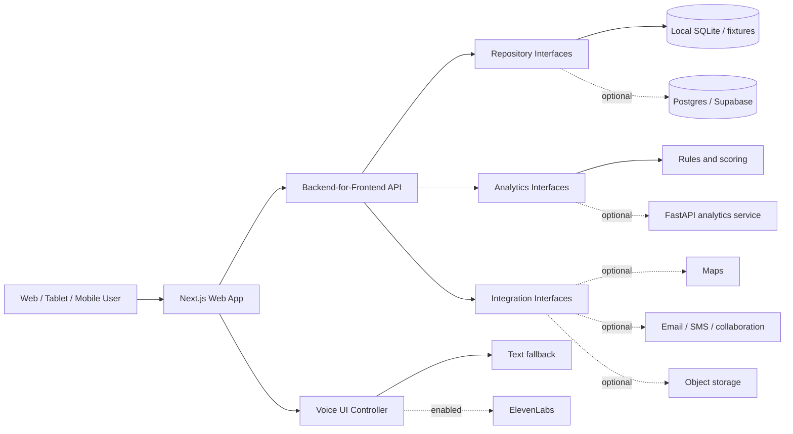

# Industrial Hackathon Starter Pack — Master Plan

## 1. Purpose

Build a reusable, demo-ready foundation that can be adapted quickly after the hackathon problem statement is revealed. The starter pack should help the team move from problem statement to a convincing end-to-end prototype in 60–90 minutes, while preserving enough modularity to support data, AI, optimization, operations, safety, sustainability, and voice-led solutions.

This is not intended to be a prebuilt answer to an unknown problem. It is a collection of reusable capabilities, contracts, UI patterns, adapters, test fixtures, and presentation assets.

## 2. Working assumptions

- The problem will probably involve industrial assets, operators, fleet or site managers, maintenance, safety, productivity, sustainability, or dealer/customer support.
- The team may receive CSV, JSON, time-series, text/manual, image, geospatial, or event data.
- Internet access and third-party services may be unreliable during judging.
- The judging demo will likely be short, so the product must communicate value within the first 30 seconds.
- The application should work with synthetic data before a real dataset is available.
- The team may need Python for analysis or ML, but not every challenge needs a separate Python service.
- Voice should be a reusable interaction layer, not the core architecture.
- No production, safety-critical, or machine-control action should be implied by a hackathon prototype.

## 3. Success criteria

### Before the event

- A new developer can clone and run the project with one documented command.
- The default experience runs without paid services or secret keys.
- A seeded demo includes at least 25 assets, 30 days of telemetry, maintenance history, alerts, and operator notes.
- The dashboard, data import, asset detail, alert flow, and demo reset are complete.
- Voice features degrade cleanly to text when ElevenLabs is unavailable.
- The repository includes problem-framing, architecture, pitch, and demo templates.
- CI verifies formatting, types, tests, builds, and secret scanning.

### During the event

- First adapted screen within 30 minutes.
- First problem-specific vertical slice within 90 minutes.
- A stable demo path is frozen several hours before submission.
- Every claimed metric has a source, formula, or explicit simulated-data label.
- The demo can be delivered without live external dependencies.

### For the final prototype

- The problem, user, pain, intervention, and measurable outcome are obvious.
- The main workflow takes no more than three major interactions.
- Every recommendation explains why it was produced.
- High-impact or destructive actions require explicit confirmation.
- The system visibly handles loading, empty, error, and offline states.

## 4. Design principles

1. **Vertical slice first:** demonstrate one complete workflow before adding breadth.
2. **Adapters over commitments:** isolate databases, AI providers, voice providers, storage, maps, and notifications.
3. **Local-first demo:** mocks and deterministic seed data are first-class features.
4. **Progressive complexity:** start with Next.js only; activate Python or managed infrastructure only when the challenge needs it.
5. **Explainability by default:** show inputs, rules, confidence, evidence, and recommended next action.
6. **Human confirmation:** suggestions may be automated; consequential actions are confirmed.
7. **Evidence over decoration:** each chart and feature should support the problem narrative.
8. **Graceful degradation:** voice becomes text, live services become fixtures, and maps become lists when dependencies fail.
9. **Accessible multimodality:** important information must never be available only through audio, color, or animation.
10. **Demo reliability:** deterministic scenarios take priority over unnecessary infrastructure sophistication.

## 5. Candidate problem families and reusable use cases

The starter pack should support these without claiming that all will be implemented before the event.

### 5.1 Predictive maintenance and asset health

- Detect abnormal temperature, vibration, pressure, fuel use, or engine-load patterns.
- Rank machines by failure risk and estimated urgency.
- Show a health score with the contributing signals.
- Estimate remaining useful life using a simple baseline or supplied model.
- Detect recurring fault-code sequences.
- Correlate failures with operating conditions or operator shifts.
- Recommend inspect, monitor, derate, or schedule-service actions.
- Compare preventive maintenance with reactive downtime cost.
- Generate a maintenance summary suitable for a technician.
- Read the summary aloud for hands-busy environments.

### 5.2 Fleet and site operations

- Show asset status, utilization, idle time, availability, and location.
- Detect underused or overloaded equipment.
- Recommend asset reassignment between sites.
- Optimize dispatch, route, or work sequencing.
- Highlight bottlenecks and queue buildup.
- Compare planned work with actual output.
- Identify shifts, sites, or asset classes with performance variance.
- Provide spoken shift-start and shift-handover summaries.

### 5.3 Safety and risk reduction

- Aggregate seat-belt, overspeed, harsh-braking, geofence, proximity, or fatigue events.
- Detect clusters of near misses by place, time, equipment, or task.
- Guide a digital pre-start inspection by voice.
- Record a hands-free incident or hazard report.
- Read critical alerts aloud while also showing them visually.
- Produce a supervisor briefing from the previous shift.
- Build scenario-based safety training with a voice coach.
- Enforce acknowledgement and escalation rules for critical alerts.

The prototype must label safety outputs as decision support, not certified safety control.

### 5.4 Fuel, energy, emissions, and sustainability

- Track fuel burn and energy consumption by asset, task, tonne, hour, or site.
- Detect excessive idle time.
- Estimate avoidable fuel, cost, and emissions.
- Recommend operating windows, charging schedules, or asset substitutions.
- Compare conventional, electric, or mixed-fleet scenarios.
- Explain how each recommendation affects productivity as well as emissions.
- Generate an evidence-linked sustainability summary.

### 5.5 Inspection, work orders, and technician productivity

- Provide configurable inspection checklists.
- Capture voice notes, photos, severity, and asset identification.
- Convert a spoken observation into a structured defect draft.
- Search relevant procedures or historical repairs.
- Create a draft work order from an alert.
- Estimate parts, skills, downtime, and priority.
- Track status from detected to acknowledged to resolved.
- Compare before/after measurements and close the loop.

### 5.6 Parts, inventory, and service planning

- Predict likely part demand from service schedules and observed risk.
- Find part shortages and excess stock.
- Group maintenance jobs to reduce repeat travel or downtime.
- Recommend a maintenance window based on production plans.
- Provide a voice-assisted parts lookup.
- Create a draft reservation or procurement request with confirmation.
- Estimate the cost of delaying a repair.

### 5.7 Operator assistance and knowledge access

- Search manuals, procedures, troubleshooting trees, and approved FAQs.
- Answer questions with citations to source passages.
- Ask clarifying questions based on model, serial range, symptom, and fault code.
- Guide troubleshooting one step at a time.
- Read procedures aloud while keeping the current step visible.
- Support multiple languages and adjustable speaking speed.
- Escalate when the knowledge base does not support a reliable answer.

### 5.8 Training and simulation

- Create role-specific onboarding paths.
- Simulate an operator, customer, or incident scenario through voice.
- Score checklist completeness and decision quality.
- Explain mistakes after the simulation rather than during it.
- Generate a personalized refresher plan.
- Provide multilingual practice without changing the underlying workflow.

### 5.9 Dealer and customer support

- Triage a customer-described symptom.
- Collect structured intake data through a voice conversation.
- Summarize calls and proposed next steps.
- Draft a service appointment or support case.
- Provide asset-specific status and maintenance reminders.
- Route complex cases to a human with the transcript and context.

### 5.10 Quality, manufacturing, and warranty

- Detect defect patterns by component, line, supplier, or batch.
- Cluster technician or warranty narratives.
- Identify repeat repairs and possible root causes.
- Guide inspection and rework procedures.
- Create a traceable evidence bundle for an investigation.
- Compare defect rate before and after a process change.

### 5.11 Project, construction, and productivity planning

- Compare planned versus actual progress.
- Forecast schedule or resource risk.
- Recommend equipment mixes.
- Simulate weather, downtime, and demand scenarios.
- Produce daily spoken briefings for site supervisors.
- Capture spoken field updates and reconcile them with the plan.

### 5.12 Accessibility and inclusion

- Narrate dashboards and alert summaries.
- Allow voice navigation with a visible transcript.
- Support captions for all generated speech.
- Provide keyboard-only and screen-reader-compatible alternatives.
- Use plain-language and multilingual explanation modes.
- Never force microphone use to complete a workflow.

## 6. Proposed technical architecture



### 6.1 Default deployment shape

- **Web and backend-for-frontend:** Next.js with TypeScript.
- **Styling:** Tailwind CSS plus a small reusable component system.
- **Charts:** one chart library only, wrapped in project components.
- **Forms and validation:** shared schemas that validate both UI inputs and API payloads.
- **Default persistence:** local fixtures plus SQLite for zero-configuration development.
- **Optional analytical queries:** DuckDB for local CSV/Parquet exploration.
- **Optional managed backend:** Postgres/Supabase when authentication, storage, realtime, or remote collaboration is genuinely required.
- **Optional analytics service:** FastAPI, Python, Pydantic, pandas/polars, scikit-learn, and optimization libraries as needed.
- **Contract generation:** OpenAPI-generated client types if the Python service is activated.
- **Testing:** unit tests, API contract tests, browser smoke tests, and deterministic demo tests.

### 6.2 Why the Python service is optional

Do not pay the operational cost of two applications unless the selected challenge needs one of the following:

- Python-only data or ML libraries.
- Long-running numerical work.
- Model serving.
- Optimization or simulation.
- Independent scaling.
- A supplied Python artifact.

Basic CRUD, rules, provider calls, authentication, and report generation can remain in the Next.js application.

### 6.3 Provider boundaries

Create interfaces with mock implementations:

```ts
interface VoiceProvider {
  synthesize(request: SpeechRequest): Promise<AudioResult>;
  createRealtimeToken(request: TokenRequest): Promise<RealtimeToken>;
}

interface TranscriptionProvider {
  createRealtimeToken(request: TokenRequest): Promise<RealtimeToken>;
  transcribeFile(request: TranscriptionRequest): Promise<Transcript>;
}

interface ConversationProvider {
  createSession(request: ConversationRequest): Promise<ConversationSession>;
}

interface AssetRepository {}
interface TelemetryRepository {}
interface AlertRepository {}
interface WorkOrderRepository {}
interface KnowledgeRepository {}
interface PredictionService {}
interface NotificationService {}
interface FileStorage {}
interface MapProvider {}
```

The rest of the application should not import an ElevenLabs SDK, database SDK, or model SDK directly.

## 7. Repository layout

```text
.
├── apps/
│   └── web/
│       ├── app/
│       │   ├── (dashboard)/
│       │   ├── api/
│       │   └── demo/
│       ├── components/
│       │   ├── charts/
│       │   ├── data-grid/
│       │   ├── equipment/
│       │   ├── feedback/
│       │   ├── forms/
│       │   ├── layout/
│       │   ├── maps/
│       │   └── voice/
│       ├── features/
│       │   ├── alerts/
│       │   ├── assets/
│       │   ├── auth/
│       │   ├── inspections/
│       │   ├── knowledge/
│       │   ├── maintenance/
│       │   ├── reports/
│       │   ├── scenarios/
│       │   └── voice/
│       ├── lib/
│       │   ├── analytics/
│       │   ├── config/
│       │   ├── repositories/
│       │   ├── security/
│       │   └── telemetry/
│       └── tests/
├── services/
│   └── analytics/
│       ├── src/
│       │   ├── api/
│       │   ├── models/
│       │   ├── pipelines/
│       │   └── services/
│       └── tests/
├── packages/
│   ├── contracts/
│   ├── config/
│   ├── design-tokens/
│   ├── demo-data/
│   └── test-utils/
├── data/
│   ├── samples/
│   ├── generated/
│   ├── schemas/
│   └── README.md
├── docs/
│   ├── decisions/
│   ├── diagrams/
│   ├── runbooks/
│   ├── architecture.md
│   ├── data-dictionary.md
│   ├── demo-script.md
│   ├── judging-questions.md
│   ├── pitch-outline.md
│   ├── problem-framing.md
│   ├── responsible-ai.md
│   └── threat-model.md
├── scripts/
│   ├── bootstrap.*
│   ├── generate-demo-data.*
│   ├── reset-demo.*
│   └── smoke-test.*
├── .env.example
├── .gitignore
├── docker-compose.yml
├── Makefile
├── package.json
└── README.md
```

Keep the directory structure shallow until real modules exist. Empty placeholder directories should not be committed.

## 8. Core domain model

### 8.1 Asset

- `id`
- `externalId`
- `name`
- `equipmentType`
- `manufacturer`
- `model`
- `serialNumber` — masked in sample data
- `siteId`
- `status`: active, idle, maintenance, offline, retired
- `commissionedAt`
- `engineHours`
- `odometer`
- `tags`
- `metadata`

### 8.2 Telemetry observation

- `assetId`
- `timestamp`
- `metric`
- `value`
- `unit`
- `quality`: good, suspect, missing, imputed
- `source`
- `latitude` and `longitude`, when permitted

Suggested metrics include temperature, vibration, pressure, voltage, state of charge, engine speed, load, idle duration, fuel rate, emissions estimate, speed, payload, and ambient conditions.

### 8.3 Event

- `id`
- `assetId`
- `timestamp`
- `type`
- `severity`
- `source`
- `title`
- `description`
- `evidence`
- `acknowledgedBy`
- `resolvedAt`

### 8.4 Alert

- `id`
- `ruleId`
- `assetId`
- `severity`
- `confidence`
- `status`: new, acknowledged, investigating, resolved, dismissed
- `triggeredAt`
- `explanation`
- `recommendedActions`
- `evidenceRefs`
- `owner`

### 8.5 Inspection

- `id`
- `assetId`
- `templateId`
- `inspectorId`
- `startedAt`
- `completedAt`
- `answers`
- `voiceNoteRefs`
- `mediaRefs`
- `defects`
- `signatureOrAcknowledgement`

### 8.6 Work order

- `id`
- `assetId`
- `sourceAlertId`
- `priority`
- `title`
- `description`
- `requiredSkills`
- `estimatedDuration`
- `parts`
- `status`
- `scheduledWindow`
- `approvalState`

### 8.7 Recommendation

- `id`
- `subjectType` and `subjectId`
- `generatedAt`
- `summary`
- `reasoningFactors`
- `confidence`
- `estimatedImpact`
- `assumptions`
- `expiresAt`
- `acceptedBy`
- `outcome`

### 8.8 Conversation and transcript

- `id`
- `userId` or anonymous session identifier
- `purpose`
- `assetId`, if relevant
- `startedAt` and `endedAt`
- `language`
- `consentState`
- `transcriptRetentionPolicy`
- `turns`
- `toolCalls`
- `summary`
- `feedback`

Do not store audio or transcripts by default. Make retention explicit and configurable.

## 9. Synthetic data system

### 9.1 Generator requirements

- Seeded randomness for repeatable demos.
- Configurable asset count, date range, sample interval, sites, and equipment classes.
- Correlated signals rather than independent random numbers.
- Shift and weekday patterns.
- Ambient weather influence.
- Operational modes: off, idle, normal, high load, degraded, maintenance.
- Sensor noise, missingness, outliers, delayed messages, and unit errors.
- Maintenance interventions that alter later telemetry.
- Ground-truth anomaly labels kept separate from user-facing data.
- Privacy-safe synthetic operator and customer records.

### 9.2 Canonical demo scenarios

1. **Bearing degradation:** vibration rises gradually, followed by temperature increase.
2. **Cooling anomaly:** temperature rises only under high load.
3. **Fuel waste:** prolonged idle periods on one shift.
4. **Safety hotspot:** multiple overspeed or proximity events in one zone.
5. **Missed inspection:** an overdue inspection correlates with a later defect.
6. **Parts constraint:** maintenance is recommended but a critical part is unavailable.
7. **Intermittent connectivity:** delayed batches arrive out of order.
8. **False alarm:** a faulty sensor produces a spike while related signals remain normal.

### 9.3 Data import workflow

1. Upload CSV, JSON, or Parquet.
2. Preview records and inferred types.
3. Map source columns to the canonical schema.
4. Select units and timezone.
5. Validate ranges, duplicates, required fields, and timestamp order.
6. Display rejected rows with reasons.
7. Save the mapping as an import profile.
8. Import to a temporary namespace before promotion.
9. Produce a data-quality report.

## 10. ElevenLabs voice architecture

Voice should be implemented in three independent capability levels. A challenge can activate only the lowest level it needs.

### 10.1 Level A — Text-to-speech narration

Use cases:

- Read an alert explanation.
- Speak a shift summary.
- Narrate the selected chart or KPI.
- Deliver an inspection instruction.
- Generate a multilingual briefing.
- Create audio for a training scenario.

Implementation:

- `POST /api/voice/speech` accepts normalized text, voice profile, language, and purpose.
- Server validates length, purpose, user authorization, and quota.
- Server calls the ElevenLabs streaming TTS API.
- Client begins playback as chunks arrive.
- Cache only safe, non-personal, repeatable prompts.
- Display the exact spoken text and playback controls.
- Provide pause, stop, replay, speed, volume, and captions.

The official ElevenLabs documentation supports HTTP or WebSocket streaming; the realtime TTS WebSocket uses a fixed voice for a connection. Use a low-latency model for interactive speech and a higher-quality model for pre-generated demo narration. Do not hardcode a model identifier throughout the application.

### 10.2 Level B — Speech-to-text command and dictation

Use cases:

- Search for an asset by voice.
- Apply filters such as “show high-risk excavators at Site A.”
- Dictate an inspection note.
- Create a hazard report draft.
- Capture a technician handover.
- Navigate the application hands-free.

Implementation:

- Request microphone permission only after a direct user gesture.
- Server creates a short-lived, single-use token.
- Browser sends microphone audio directly to ElevenLabs realtime STT.
- UI renders partial transcripts differently from committed transcripts.
- Only committed transcript segments can trigger parsing or actions.
- Voice activity detection is the default for microphone capture.
- User reviews structured results before submission.
- A keyboard/text equivalent is always available.

The ElevenLabs realtime STT documentation distinguishes replaceable partial transcripts from committed transcript segments and recommends temporary tokens for browser clients. The API key must never be shipped to the browser.

### 10.3 Level C — Conversational voice copilot

Use cases:

- Ask about fleet status and drill into a selected asset.
- Conduct a guided inspection.
- Triage a fault with clarifying questions.
- Run a training simulation.
- Create a maintenance or incident draft.
- Navigate and filter the interface.
- Produce a spoken executive or shift briefing.

Implementation options:

1. Use the ElevenLabs React SDK and an ElevenLabs conversational agent.
2. Use ElevenLabs STT and TTS around an application-owned orchestration layer.

Start with option 1 for speed. Use option 2 only when the challenge requires strict orchestration ownership, model portability, or custom retrieval/tool logic.

For an authenticated agent:

1. Browser calls `POST /api/voice/session`.
2. Server verifies the application session and applies rate limits.
3. Server requests a temporary signed URL using the secret API key.
4. Browser connects with the signed URL.
5. Browser registers allowlisted client tools.
6. Server-side operations remain protected behind authenticated webhooks/APIs.
7. Conversation completion may enqueue transcript summarization if consent permits.

ElevenLabs recommends signed URLs for protected client-side agent sessions. Signed URLs expire; never return or log the underlying API key.

### 10.4 Voice tools

Split tools into read-only, draft, and consequential groups.

#### Read-only tools

- `get_fleet_summary`
- `get_asset_status`
- `get_recent_alerts`
- `explain_health_score`
- `search_knowledge`
- `get_maintenance_history`
- `compare_assets`
- `describe_current_screen`

These may execute immediately after normal authorization checks.

#### Client/UI tools

- `navigate_to_asset`
- `apply_dashboard_filters`
- `open_alert_details`
- `highlight_chart_range`
- `show_confirmation_dialog`
- `set_accessibility_preferences`

ElevenLabs supports client tools for browser-side behavior. Tool names, parameters, and descriptions must match the configured agent exactly.

#### Draft-producing tools

- `draft_work_order`
- `draft_incident_report`
- `draft_inspection_note`
- `draft_shift_handover`
- `draft_parts_request`

The result must appear onscreen for editing and confirmation.

#### Consequential tools

- `submit_work_order`
- `acknowledge_critical_alert`
- `send_notification`
- `reserve_part`
- `schedule_maintenance`

Rules for consequential tools:

- Never execute from an ambiguous utterance.
- Read back the target, effect, and important parameters.
- Require an explicit confirmation interaction.
- Revalidate authorization server-side.
- Use an idempotency key.
- Record an audit event.
- Return an unambiguous success or failure result.
- Do not implement physical machine control in the starter pack.

### 10.5 Voice state machine

```text
idle
  -> requesting_permission
  -> connecting
  -> listening
  -> processing
  -> speaking
  -> listening
  -> ending
  -> ended

Any active state -> recovering -> text_fallback or ended
```

The UI must always show microphone state, connection state, whether the assistant is listening or speaking, and a stop control.

### 10.6 Interruption and concurrency rules

- Stop or duck playback when the user starts speaking.
- Cancel stale TTS when the selected asset or page changes.
- Prevent two simultaneous voice sessions in one browser tab.
- Use request IDs so old audio and transcripts cannot update a new session.
- Abort pending tool calls when the session is deliberately ended where safe.
- Do not abort a server-side write after it has passed the commit boundary; instead report the final state.

### 10.7 Voice privacy and safety

- Explain microphone use before permission is requested.
- Provide a visible recording/listening indicator.
- Never enable the microphone on page load.
- Keep API keys server-side.
- Use scoped, expiring keys and budget limits where available.
- Redact secrets, personal data, and sensitive identifiers from logs.
- Default to no audio retention and minimal transcript retention.
- Require explicit consent before storing a transcript or recording.
- Do not clone a real person’s voice without documented consent and authorization.
- Treat spoken instructions as untrusted input.
- Protect every tool with the same authorization as its non-voice endpoint.
- Add prompt-injection defenses to retrieved documents and tool output.
- Mark generated advice as advisory when safety or maintenance decisions are involved.

### 10.8 Voice failure modes and fallbacks

| Failure | User experience | Technical response |
|---|---|---|
| Microphone denied | Show text input and permission help | Do not retry automatically |
| ElevenLabs unavailable | Continue in text mode | Open circuit breaker temporarily |
| Network interruption | Show reconnect state and transcript | Retry with bounded backoff |
| Quota/rate limit | Explain that voice is temporarily unavailable | Disable voice, preserve text workflow |
| Noisy audio | Ask user to repeat or edit transcript | Surface input-level guidance |
| Wrong transcription | Allow correction before action | Use committed text only |
| Tool timeout | Say the request could not be completed | Return typed error and retry option |
| Ambiguous command | Ask one focused question | Do not infer consequential parameters |
| Duplicate webhook | No duplicate action | Enforce idempotency/deduplication |

### 10.9 Voice acceptance tests

- API key is absent from browser bundles, HTML, network responses, and logs.
- Signed URLs or single-use tokens require an authenticated application request.
- Permission denial leaves the full text experience usable.
- Partial transcripts cannot submit a form.
- A voice-created work order remains a draft until confirmed.
- Critical action confirmation includes target and consequence.
- Starting a second session terminates or rejects the first predictably.
- Voice cancellation stops audio within an acceptable threshold.
- Captions match the spoken response.
- The demo works with a mocked provider and recorded fixtures.

## 11. Application routes and screens

### Public/demo

- `/` — concise value proposition and demo entry.
- `/demo` — choose/reset a deterministic scenario.
- `/about` — problem, architecture, and limitations for judges.

### Operations

- `/overview` — fleet KPIs, trends, high-priority alerts, map/list.
- `/assets` — searchable and filterable inventory.
- `/assets/[id]` — health, telemetry, alerts, history, recommendations.
- `/alerts` and `/alerts/[id]` — triage workflow and evidence.
- `/maintenance` — schedule, backlog, work orders, and parts constraints.
- `/inspections` — templates, in-progress inspections, findings.
- `/operations` — utilization, idle time, throughput, bottlenecks.
- `/safety` — events, leading indicators, hotspots, acknowledgements.
- `/sustainability` — fuel, energy, emissions, avoidable waste.
- `/knowledge` — cited search and guided troubleshooting.
- `/reports` — generated summaries and export.
- `/settings/voice` — voice, language, captions, retention, test controls.

### Reusable UI components

- KPI card with value, unit, delta, period, status, and explanation.
- Time-series chart with threshold bands and event annotations.
- Ranked-risk table.
- Data-quality badge.
- Confidence and evidence panel.
- Recommendation card with expected effect and assumptions.
- Timeline for telemetry, alerts, inspections, and maintenance.
- Map/list switcher.
- File import wizard.
- Confirmation dialog.
- Voice orb/button with non-color state labels.
- Live transcript panel.
- Audio player with caption and speed controls.
- Demo control bar and reset button.

## 12. Analytics and decision-support library

### 12.1 Baseline methods to prepare

- Static and rolling thresholds.
- Z-score and robust median absolute deviation anomaly detection.
- Rate-of-change and persistence rules.
- Multisignal voting.
- Exponentially weighted moving averages.
- Simple linear trend and time-to-threshold estimates.
- Isolation Forest as an optional unsupervised baseline.
- Basic classification/regression template when labelled data exists.
- Cost/impact scoring.
- Priority matrix combining severity, confidence, exposure, and urgency.
- Simple assignment, scheduling, or routing optimization template.

### 12.2 Explainability contract

Every prediction or recommendation should return:

- Result or score.
- Confidence/calibration status.
- Top contributing inputs.
- Applicable rule or model version.
- Data window used.
- Missing or suspect data warning.
- Recommended next step.
- Expected benefit and uncertainty.
- Expiration/recalculation time.

### 12.3 Evaluation toolkit

- Train/validation/test separation by asset and time when applicable.
- Leakage checks.
- Accuracy, precision, recall, F1, AUROC, and PR-AUC templates.
- MAE, RMSE, MAPE caveats, and interval coverage for forecasts.
- Alert volume, lead time, false alarms per asset-day, and missed-event rate.
- Operational metrics such as avoided downtime, inspection time, and fuel saved.
- Threshold sweep and confusion-matrix visualization.
- Baseline comparison, not just a standalone model score.

### 12.4 Responsible claims

- Do not call an unsupervised anomaly a predicted failure without evidence.
- Do not fabricate savings; label scenario estimates and assumptions.
- Separate correlation from causation.
- Show sample size and time period.
- Document synthetic-data evaluation separately from real-data evaluation.
- State where a human expert remains necessary.

## 13. Knowledge and generative-AI module

Keep this optional and provider-neutral.

### Supported workflows

- Search documents and return cited passages.
- Summarize an asset history.
- Convert technical data into role-specific explanations.
- Draft reports, work orders, and shift handovers.
- Generate follow-up questions for incomplete reports.
- Translate approved content.

### Retrieval requirements

- Preserve source title, section, page/anchor, and version.
- Restrict answers to retrieved evidence when operating in grounded mode.
- Make “insufficient evidence” a valid outcome.
- Separate user content from system instructions.
- Scan or reject unsupported file types.
- Record which document chunks supported a generated answer.
- Never treat retrieved document instructions as trusted system instructions.

### Provider abstraction

```ts
interface LanguageModelProvider {
  generate(request: GenerationRequest): Promise<GenerationResult>;
  stream(request: GenerationRequest): AsyncIterable<GenerationChunk>;
}

interface EmbeddingProvider {
  embed(input: string[]): Promise<number[][]>;
}
```

The starter pack should include a deterministic rules/template fallback for the core demo.

## 14. Security, privacy, and trust baseline

### Secrets

- Commit `.env.example`, never `.env`.
- Validate required environment variables at startup.
- Separate public and server-only variables.
- Use scoped keys, short expirations, and spend/credit limits.
- Add secret scanning locally and in CI.
- Never print provider tokens or signed URLs.

### API and authorization

- Validate every request body and response shape.
- Enforce authorization server-side, including voice tools.
- Rate-limit token issuance, uploads, expensive analysis, and speech generation.
- Use CSRF protection where cookie-authenticated writes require it.
- Restrict CORS.
- Apply upload size, type, and content checks.
- Use idempotency keys for external writes.
- Verify webhook signatures and deduplicate retries.

### Data governance

- Classify public, internal, confidential, and sensitive fields.
- Minimize location, operator, customer, and conversation data.
- Make synthetic/demo data unmistakable.
- Define retention for uploads, transcripts, audio, and logs.
- Provide deletion/reset for demo data.
- Record consent and provenance.

### Application safety

- Escape/sanitize rendered user content.
- Defend against spreadsheet formula injection in exports.
- Prevent path traversal in uploads/downloads.
- Do not expose raw stack traces to users.
- Add security headers.
- Pin lockfiles and review newly added dependencies.
- Create a lightweight threat model before connecting real data.

## 15. Reliability and observability

### Structured events

- `data_import_started/completed/failed`
- `analysis_started/completed/failed`
- `alert_created/acknowledged/resolved`
- `recommendation_viewed/accepted/rejected`
- `voice_session_started/ended/failed`
- `voice_tool_requested/confirmed/completed/failed`
- `demo_scenario_reset`

### Correlation

- Generate a request/correlation ID at the edge.
- Propagate it through application APIs, Python service, provider calls, and webhooks.
- Use conversation and tool-call IDs without logging sensitive content.

### Useful measurements

- Page and API latency.
- Import duration and rejected-row count.
- Analysis duration.
- Time to first audio.
- Voice connection failures and fallback rate.
- Tool-call success and confirmation abandonment.
- External-provider error and rate-limit counts.
- Demo reset success.

### Resilience

- Timeouts on all external requests.
- Bounded retries only for safe/idempotent operations.
- Circuit breakers for unreliable providers.
- Cancellation for abandoned analysis and audio.
- Health, readiness, and dependency status endpoints.
- A visible demo status panel available behind a development flag.

## 16. Testing strategy

### Unit tests

- Schema validation and unit conversion.
- Health score and alert rules.
- Recommendation ranking.
- Permission and confirmation policies.
- Redaction and export sanitization.
- Voice state transitions.

### Contract tests

- Web-to-Python OpenAPI compatibility.
- Repository adapter behavior.
- Provider adapter mocks.
- Webhook signature and idempotency behavior.
- ElevenLabs token/session endpoint response shape.

### Integration tests

- Import -> normalize -> analyze -> alert -> recommendation.
- Voice transcript -> draft -> review -> confirmation -> save.
- Alert -> work-order draft -> approval -> audit trail.
- Provider timeout -> fallback.
- Demo reset -> known seeded state.

### Browser smoke tests

- Dashboard loads seeded data.
- Asset filters and deep links work.
- One chart and table render correctly.
- Import wizard accepts a known fixture and rejects a bad fixture.
- Critical workflow succeeds without voice.
- Voice-disabled state is understandable.
- Mobile viewport preserves the primary workflow.

### Visual and demo regression

- Capture screenshots for the canonical demo flow.
- Check overflow, clipped labels, empty states, and dark mode.
- Verify the projector-friendly color contrast.
- Rehearse on the actual laptop, browser, network, and display resolution.

## 17. Developer experience

### Required commands

```text
setup          install dependencies and validate prerequisites
dev            start the default local application
dev-full       start web, database, and Python service
seed           generate/load deterministic data
reset-demo     restore the canonical demo state
check          format check, lint, typecheck, and unit tests
test-e2e       run browser smoke tests
build          create production builds
doctor         print environment and dependency diagnostics
```

Commands may be implemented through package scripts, Make, or a cross-platform task runner, but the README should present one canonical interface.

### Configuration flags

```text
DEMO_MODE=true
VOICE_PROVIDER=mock|elevenlabs
VOICE_ENABLED=false
TRANSCRIPTION_ENABLED=false
CONVERSATIONAL_AGENT_ENABLED=false
ANALYTICS_BACKEND=local|fastapi
DATA_BACKEND=fixtures|sqlite|postgres
AI_PROVIDER=mock|configured-provider
MAP_PROVIDER=mock|configured-provider
STORE_TRANSCRIPTS=false
STORE_AUDIO=false
```

Feature flags should be server-controlled where they protect paid or sensitive capabilities.

## 18. Demo engineering

### Golden path

1. Open with the operational problem and affected user.
2. Show fleet/site overview and one abnormal asset.
3. Drill into evidence and explain the health/risk change.
4. Ask the voice copilot for an explanation or shift summary.
5. Show the transcript and cited/evidenced response.
6. Generate a draft action, such as inspection or work order.
7. Confirm it visibly.
8. Show estimated operational impact and limitations.
9. End with scalability and next steps.

### Backup paths

- Recorded audio samples if microphone capture is poor.
- Text input that invokes the same command pipeline.
- Local canned TTS/audio when ElevenLabs is inaccessible.
- Static map screenshot/list view when map tiles fail.
- Seeded results when model execution is slow.
- Short screen recording as the final emergency fallback.

### Demo controls

- Reset scenario.
- Advance simulated time.
- Inject a predefined event.
- Toggle network/provider failure.
- Toggle voice/mock provider.
- Reveal ground truth only in a presenter/debug view.

Do not expose obviously fake debug controls during the main judging path.

## 19. Documentation and presentation pack

### `problem-framing.md`

- User and environment.
- Current workflow.
- Pain and evidence.
- Root cause versus symptom.
- Constraints.
- Proposed intervention.
- Success metrics.
- Assumptions and validation questions.

### `architecture.md`

- Context diagram.
- Container/component diagram.
- Key request sequences.
- Provider boundaries.
- Deployment variants.
- Security and failure considerations.

### `pitch-outline.md`

- Hook.
- Problem and affected user.
- Why existing workflow is insufficient.
- Product demonstration.
- Technical differentiation.
- Measured or estimated impact.
- Responsible limitations.
- Adoption path.
- Closing statement.

### `demo-script.md`

- Exact clicks and spoken lines.
- Expected state after every step.
- Time budget.
- Presenter ownership.
- Reset procedure.
- Fallback for each external dependency.
- Likely judge interruption points.

### `judging-questions.md`

Prepare answers for:

- Where did the data come from?
- How was the model evaluated?
- What is genuinely implemented versus simulated?
- What happens when the model is wrong?
- Why is voice valuable here?
- How is sensitive data protected?
- How does this integrate with existing systems?
- What is the cost and deployment path?
- What would be required for production or safety certification?
- What did the team learn or validate?

## 20. Implementation roadmap

### Phase 0 — Decisions and skeleton (2–3 hours)

- Record supported runtimes and package manager.
- Create the web application and quality scripts.
- Establish environment validation and feature flags.
- Add README bootstrap instructions.
- Add CI skeleton.
- Define the canonical domain schemas.

Exit criteria: clean clone, setup, test, and build all pass.

### Phase 1 — Demo foundation (4–6 hours)

- Create layout, navigation, theme, feedback states, and demo banner.
- Build overview, assets table, and asset detail.
- Add fixture repository.
- Generate canonical synthetic scenarios.
- Add demo reset.
- Add responsive and accessibility baseline.

Exit criteria: a stable non-voice demo tells a simple asset-health story.

### Phase 2 — Data ingestion and analytics (5–8 hours)

- Implement upload preview and column mapping.
- Normalize units and timestamps.
- Produce data-quality results.
- Add rules, anomaly baseline, health score, and explanations.
- Add alert triage and recommendation components.
- Add tests around the golden scenario.

Exit criteria: an uploaded fixture produces an explainable alert and recommendation.

### Phase 3 — ElevenLabs voice foundation (4–6 hours)

- Implement `VoiceProvider` mock and ElevenLabs adapter.
- Add secure server-only TTS endpoint.
- Add streaming playback, transcript/caption display, and controls.
- Add short-lived token issuance for realtime transcription.
- Implement push-to-talk dictation.
- Add provider failure and text fallback tests.

Exit criteria: alert narration and dictated inspection notes work without exposing credentials.

### Phase 4 — Conversational copilot (5–8 hours)

- Add authenticated signed-session endpoint.
- Integrate the current ElevenLabs React SDK.
- Implement read-only client tools.
- Add current-screen and selected-asset context.
- Implement one draft-producing tool.
- Add confirmation policy and audit events.
- Test interruption, duplicate calls, timeout, and cancellation.

Exit criteria: a user can ask about an asset, navigate to it, and create a confirmed draft action.

### Phase 5 — Optional modules (choose based on team strength)

- FastAPI analytics service.
- Local knowledge retrieval with citations.
- Map/geospatial view.
- Optimization template.
- Image/inspection upload.
- Authentication and role-based views.
- Postgres/Supabase adapter.
- Report/PDF export.
- Multilingual demo.

Only activate modules that the team can test and explain.

### Phase 6 — Hardening and rehearsal (4–6 hours)

- Complete threat model and privacy review.
- Run CI and dependency/secret scans.
- Measure cold start and voice latency.
- Finish error, empty, and offline states.
- Capture backup media.
- Rehearse multiple times under the judging time limit.
- Freeze the golden path and tag a demo build.

## 21. Priority backlog

### P0 — Build before the hackathon

- One-command setup.
- Responsive dashboard shell.
- Synthetic data generator and deterministic fixtures.
- Asset list/detail, chart, alerts, and recommendations.
- Import preview and schema validation.
- Feature flags and provider mocks.
- Demo reset and golden scenario.
- Environment/security baseline.
- Tests and CI.
- Problem, architecture, pitch, and demo templates.
- ElevenLabs server adapter, TTS narration, and text fallback.

### P1 — High-value preparation

- Realtime transcription and dictated notes.
- Conversational-agent signed session.
- Read-only voice tools and one confirmed draft flow.
- Data-quality report.
- Maintenance and inspection workflows.
- Local knowledge search with citations.
- Python analytics service template.
- Map/list component.
- Export/report template.
- Demo failure toggles and backup recording.

### P2 — Add only with spare time

- Authentication and roles.
- Managed database deployment.
- Advanced anomaly or forecasting models.
- Scheduling/route optimization.
- Multilingual voice presets.
- Image inspection model adapter.
- Notification connectors.
- Post-conversation summaries and analytics.
- PWA/offline capture.

### Explicit non-goals before problem selection

- Kubernetes or multi-region deployment.
- Physical equipment control.
- Production-grade digital twins.
- Training a large custom model.
- Voice cloning.
- Complex event-stream infrastructure.
- Multiple interchangeable UI frameworks.
- A generic chatbot disconnected from an operational workflow.

## 22. Problem-reveal adaptation playbook

### First 15 minutes

- Restate the user, job, pain, constraint, and required output.
- Identify judging criteria and hard requirements.
- Separate known data from assumed data.
- Select one measurable outcome.
- Decide whether voice solves a real interaction constraint.

### Minutes 15–30

- Map the problem to existing domain entities and components.
- Select the golden demo scenario.
- Disable irrelevant modules.
- Choose local-only or full architecture.
- Assign product/story, frontend, data/backend, and integration owners.

### Minutes 30–60

- Rename navigation and labels around the selected user.
- Adapt the data generator or import mapping.
- Implement the simplest valid rule/baseline.
- Update the landing problem statement and demo narrative.

### Minutes 60–90

- Complete one end-to-end vertical slice.
- Add a deterministic fixture for it.
- Test the slice without external providers.
- Record assumptions and limitations.

### Go/no-go questions for voice

Use voice when at least one is true:

- The user’s hands or eyes are occupied.
- Speech materially shortens data entry.
- The environment benefits from audible alerts or briefings.
- Multilingual access is important.
- A conversational workflow naturally gathers missing details.
- Accessibility is a core user need.

Do not lead with voice when it is merely decorative, the environment is too noisy, privacy is incompatible, text is faster, or the network dependency threatens the core demo.

## 23. Team workflow

### Suggested ownership

- **Product/story owner:** problem framing, success metrics, scope, pitch, demo.
- **Frontend owner:** screens, interaction, responsive/accessibility, demo polish.
- **Data/ML owner:** schema, data quality, analysis, evaluation, explanations.
- **Platform/integration owner:** APIs, voice, security, deployment, observability.

For a smaller team, combine product with frontend and data with platform.

### Branch and review discipline

- Keep changes small enough to review quickly.
- Require one reviewer for schema, auth, provider, and demo-path changes.
- Avoid broad refactors after demo freeze.
- Record important choices as short architecture decision records.
- Protect the known-good demo tag/commit.

### Scope control

Maintain three lists:

- **Must demonstrate** — one complete outcome.
- **Should support** — reinforces credibility.
- **Could mention** — roadmap only.

Every new feature must displace something or have a named owner and time budget.

## 24. Definition of ready

The starter pack is ready when:

- Setup works from a clean clone.
- No secret is required for the default demo.
- Sample data provenance is documented.
- The golden workflow has automated smoke coverage.
- Provider outages have tested fallbacks.
- Voice credentials are server-only.
- The UI is usable by keyboard and without audio.
- The demo reset is reliable.
- Architecture and limitations are documented.
- A teammate who did not build it can present the demo.

## 25. Definition of done for a hackathon submission

- The implementation addresses the assigned problem, not the generic starter narrative.
- The primary user and outcome are explicit.
- The demo path is rehearsed and time-boxed.
- Real, synthetic, simulated, and mocked elements are clearly distinguished.
- Model and rule performance is reported honestly.
- Security, privacy, failure, and human-oversight considerations are stated.
- The repository builds and runs from documented instructions.
- The final submission includes architecture, screenshots, demo video/link, and team contributions.

## 26. Current official references

- [Next.js App Router documentation](https://nextjs.org/docs/app/getting-started)
- [FastAPI testing documentation](https://fastapi.tiangolo.com/tutorial/testing/)
- [Supabase local development](https://supabase.com/docs/guides/local-development)
- [ElevenLabs realtime text-to-speech](https://elevenlabs.io/docs/eleven-api/guides/how-to/websockets/realtime-tts)
- [ElevenLabs realtime speech-to-text client streaming](https://elevenlabs.io/docs/eleven-api/guides/how-to/speech-to-text/realtime/client-side-streaming)
- [ElevenLabs React SDK](https://elevenlabs.io/docs/eleven-agents/libraries/react)
- [ElevenLabs agent authentication and signed URLs](https://elevenlabs.io/docs/eleven-agents/customization/authentication)
- [ElevenLabs client tools](https://elevenlabs.io/docs/eleven-agents/customization/tools/client-tools)
- [ElevenLabs webhook guidance](https://elevenlabs.io/docs/eleven-api/resources/webhooks)
- [ElevenLabs API key security](https://elevenlabs.io/docs/overview/administration/workspaces/api-keys)

Review provider documentation immediately before implementation because SDK APIs, model names, quotas, and platform behavior can change.
